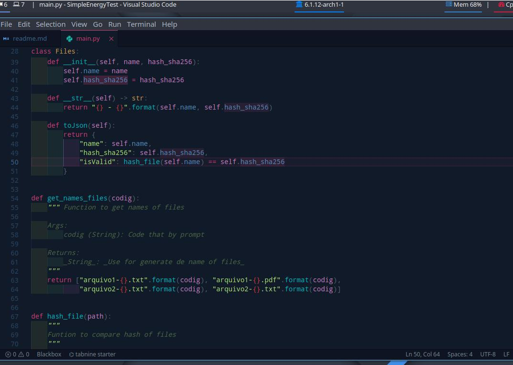

# Script for test the Junior/Pleno job in SimpleEnergy
<hr>

<hr>
<br>
<br>

### The script is created so that it is able to obtain information from the website https://simpleenergy.com.br/teste/ <br> that, depending on the access code, it is possible to see the files that are available, download them and obtain the <br> information that they have, in this case, two types of txt files and two pdf files and what they contain are hashes.<br>

<br>

## To run the file it is important to have some things pre-installed 

<br />

#### Create the virtual enviroment  and activate it

<hr>

 ```zsh
  virtualenv  venv 
  source venv/bin/active
  ``` 
  
  <br/>

#### Install the requeriments from the file requirements.txt
<hr>

```zsh
pip install -r requirements.txt
```

#### After installing all that is left is to run the code and add the code to access the information and the script just <br> 
does the rest and returns a json file with the necessary information.<br>
<hr>

```zsh
python main.py
```


##### Thanks you very much for everything and the opportunity
